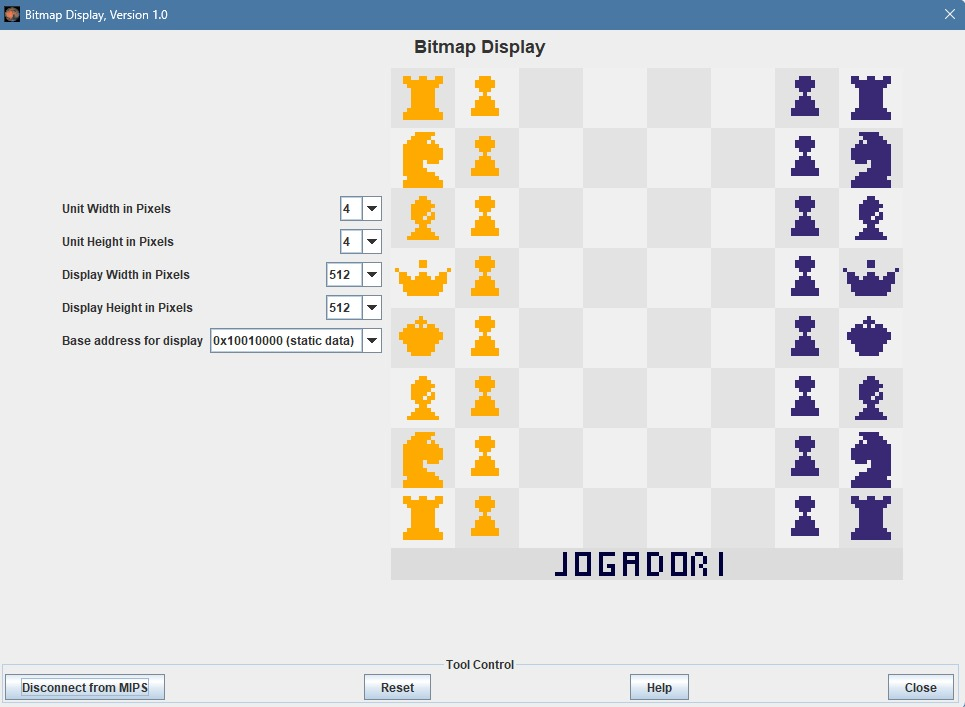
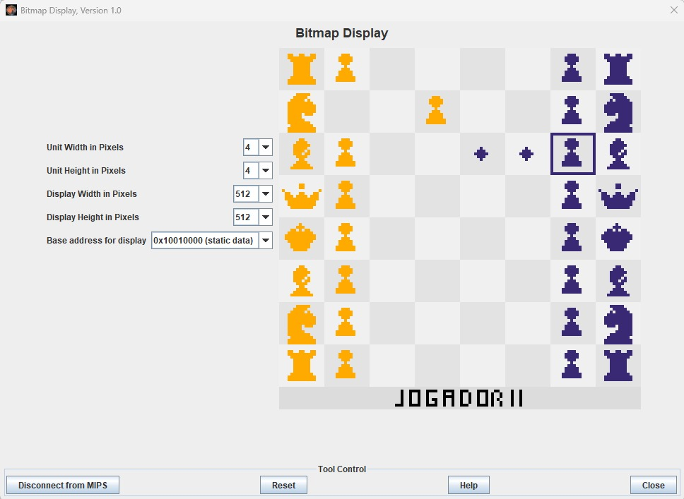
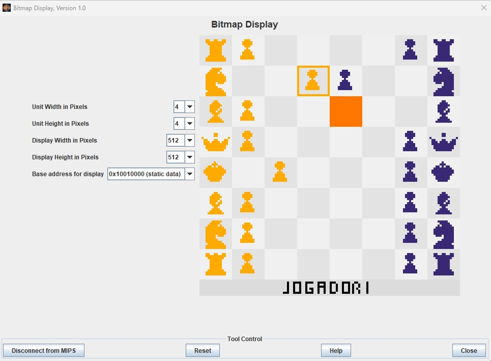

# Jogo de Xadrez em MIPS Assembly

Este projeto implementa um jogo de xadrez utilizando a linguagem Assembly para o simulador **MIPS Mars**. O objetivo é simular um tabuleiro de xadrez com peças controladas por código assembly, gerenciando a posição das peças e a lógica do jogo.

## Visão Geral

O jogo foi dividido em dois arquivos principais:
- **xadrez.asm**: O arquivo principal que configura o tabuleiro e as cores das casas e das peças.
- **pecas.asm**: O arquivo contendo as funções das peças no tabuleiro.

### Funcionalidades

- Representação das peças de xadrez (torres, cavalos, bispos, rainha, rei e peões) usando números inteiros.
- Controle de cores para as casas e para as peças do tabuleiro.
- Estrutura do tabuleiro implementada diretamente na memória do MIPS.
- Funções para manipular cada peça (mover, apagar, redesenhar).

## Estrutura dos Arquivos

### `xadrez.asm`

Este arquivo contém:
- A configuração inicial do tabuleiro, preenchendo as casas com os valores correspondentes às peças (números inteiros).
- Definição das cores das casas e das peças.
- Chamadas para as funções de manipulação das peças presentes no arquivo `pecas.asm`.

## Representação das Peças

| Número | Peça             |
|--------|------------------|
| 0      | Casa vazia       |
| 1      | Peão amarelo     |
| 2      | Rei amarelo      |
| 3      | Torre amarela    |
| 4      | Cavalo amarelo   |
| 5      | Bispo amarelo    |
| 6      | Rainha amarela   |
| 7      | Peão roxo        |
| 8      | Torre roxa       |
| 9      | Cavalo roxo      |
| 10     | Bispo roxo       |
| 11     | Rainha roxa      |
| 12     | Rei roxo         |

## Como Executar

1. Abra o MIPS Mars.
2. Carregue o arquivo `xadrez.asm`.
3. Monte o programa e execute para ver o tabuleiro de xadrez representado na memória.

## Contribuições

Sinta-se à vontade para contribuir com melhorias, correções e novas funcionalidades!
## Próximos Passos
- Implementar o movimento das peças.
- Adicionar regras de captura e checagem.
- Melhorar a interface visual.

